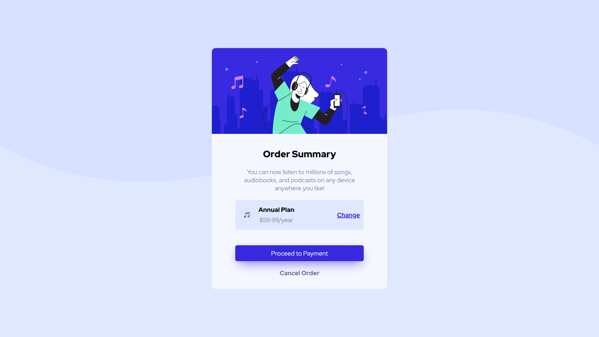

# Frontend Mentor - Order summary card solution

This is a solution to the [Order summary card challenge on Frontend Mentor](https://www.frontendmentor.io/challenges/order-summary-component-QlPmajDUj). Frontend Mentor challenges help you improve your coding skills by building realistic projects.

## Table of contents

- [Overview](#overview)
  - [The challenge](#the-challenge)
  - [Screenshot](#screenshot)
  - [Links](#links)
- [My process](#my-process)
  - [Built with](#built-with)
  - [What I learned](#what-i-learned)
- [Author](#author)

**Note: Delete this note and update the table of contents based on what sections you keep.**

## Overview

### The challenge

Users should be able to:

- See hover states for interactive elements

### Screenshot



### Links

- Solution URL: [https://github.com/iamzaidmohammed/order-summary-card](https://github.com/iamzaidmohammed/order-summary-card)
- Live Site URL: [https://order-summary-card-sooty.vercel.app/](https://order-summary-card-sooty.vercel.app/)

## My process

### Built with

- Semantic HTML5 markup
- CSS custom properties
- Flexbox
- CSS Grid
- Mobile-first workflow

### What I learned

```html
<h1>Some HTML code I'm proud of</h1>
```

```css
.proud-of-this-css {
  color: papayawhip;
}
```

## Author

- Website - [Zaid Mohammed](https://iamzaidmohammed.github.io)
- Frontend Mentor - [@zaidmohammed7](https://www.frontendmentor.io/profile/zaidmohammed7)
- Twitter - [@iamzaidmohammed](https://www.twitter.com/iamzaidmohammed)
